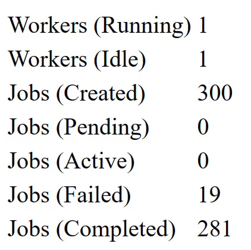

# Composable Queue

[](https://github.com/gnikyt/cq/actions/workflows/cq.yml)

An auto-scalling queue which processes functions as jobs. The jobs can be simple functions or composed of the supporting job wrappers.

Wrapper supports for retries, timeouts, deadlines, delays, backoffs, overlap prevention, uniqueness, batch operations, job release/retry, job tagging, priority queues, and potential to write your own!

This is inspired from great projects such as Bull, Pond, Ants, and more.

* [Testing](#testing)
  - [Benchmarks](#benchmarks)
* [Building](#building)
* [Examples](#examples)
  - [Queue](#queue)
    + [Tallies](#tallies)
    + [Enqueue](#enqueue)
    + [Idle worker tick](#idle-worker-tick)
  - [Panic handler](#panic-handler)
  - [Context](#context)
  - [Stopping](#stopping)
  - [Jobs](#jobs)
    + [Function](#function)
    + [Retries](#retries)
    + [Backoff](#backoff)
    + [Result catch](#result-catch)
    + [Timeout](#timeout)
    + [Deadline](#deadline)
    + [Overlaps](#overlaps)
    + [Unique](#unique)
    + [Chains](#chains)
    + [Pipeline](#pipeline)
    + [Batch](#batch)
    + [Release](#release)
    + [Tagged](#tagged)
    + [Your own](#your-own)
  - [Priority Queue](#priority-queue)
    + [Basic Usage](#basic-usage)
    + [Priority Levels](#priority-levels)
    + [Weighting](#weighting)
  - [Demo](#demo)

## Testing

`make test`

Example result:

    ok      github.com/gnikyt/cq    10.484s coverage: 91.8% of statements
    PASS

\>90% coverage currently, on the important parts. Tests are time-based which will be swapped/improved in the future.

### Benchmarks

`make bench`

Runs the following benchmarks:

1. 100 requests each pushing 10,000 jobs
2. 1,000 requests each pushing 1,000 jobs
3. 10,000 requests each pushing 100 jobs
4. 1,000,000 requests each pushing 10 jobs
5. 1 request pushing 1 job

Example result (WSL):

    cpu: Intel(R) Core(TM) i7-8650U CPU @ 1.90GHz
    BenchmarkScenarios/100Req--10kJobs-8                   2         582232006 ns/op         8204560 B/op       2028 allocs/op
    BenchmarkScenarios/1kReq--1kJobs-8                     2         658066621 ns/op         8512672 B/op       6693 allocs/op
    BenchmarkScenarios/10kReq--100Jobs-8                   2        2067297391 ns/op        34609016 B/op     169945 allocs/op
    BenchmarkScenarios/1mReq--10Jobs-8                     2        8600135828 ns/op        43627288 B/op    1017660 allocs/op
    BenchmarkSingle-8                                      2            813900 ns/op         8004360 B/op         16 allocs/op
    PASS

## Building

`make build`

Binary will be located in `dist/cq`. You will need to grant execution permissions.

## Examples

### Queue

Queue needs a minimum to maximum amount of workers to run and a capacity. There are other options you can configure as well.

```go
// Create a queue with 1 always-running worker.
// 100 maximum workers.
// Capacity of 1000 jobs.
queue = NewQueue(1, 100, 1000)
queue.Start()
// true = wait for jobs to finish before exiting.
defer queue.Stop(true)
```

#### Tallies

You can pull current stats for the queue.

* `RunningWorkers() int` returns the number of running workers.
  - Example: `fmt.Printf("%d running workers", queue.RunningWorkers())`
* `IdleWorkers() int` returns the number of idle workers.
  - Example: `fmt.Printf("%d idle workers", queue.IdleWorkers())`
* `Capacity() int` returns the configured job capacity.
  - Example: `fmt.Printf("%d capacity for jobs", queue.Capacity())`
* `WorkerRange() (int, int)` returns the configured minimum and maximum workers.
  - Example: `fmt.Printf("%d max workers", queue.WorkerRange()[1])`
* `TallyOf(JobState) int` returns the number of jobs for a given state.
  - Example: `fmt.Printf("%d failed jobs", queue.TallyOf(JobStateFailed))`

#### Enqueue

You can push jobs to the queue in a few ways.

* `Enqueue(Job)` will push the job to the queue, non-blocking.
  - Example: `Enqueue(job)`
* `TryEnqueue(Job) bool` will try and push the job to the queue, and return if successful or not, blocking.
  - Example: `ok := TryEnqueue(job)`
* `DelayEnqueue(Job, delay time.Duration)` will push the job to the queue in a seperate goroutine after the delay, non-blocking.
  - Example: `DelayEnqueue(job, time.Duration(2 * time.Minute))`
* `EnqueueBatch([]Job)` will enqueue multiple jobs at once.
  - Example: `EnqueueBatch(jobs)`
* `DelayEnqueueBatch([]Job, delay time.Duration)` will enqueue multiple jobs after a delay.
  - Example: `DelayEnqueueBatch(jobs, time.Duration(30 * time.Second))`

#### Idle worker tick

You can configure how often to remove idle workers.

```go
// Check every 500ms for idle workers to remove.
queue := NewQueue(
  2,
  5,
  100,
  WithWorkerIdleTick(time.Duration(500 * time.Millisecond)),
)
```

### Panic handler

Configure a handler for panics so the queue does not crash if/when a panic happens.

A panic can happen from the job itself or if the queue has reached max capacity (using `Enqueue`, not `TryEnqueue`).

```go
queue := NewQueue(
  2,
  5,
  100,
  WithPanicHandler(func (err any) {
    // err can be a string, error, etc.. you can use type assert to check and handle as you need..
    log.Errorf("Job or queue failed: %v", %v)
  }),
)
```

### Context

Pass a custom context to the queue.

By default, the queue will configure a cancelable background context. An example usecase is if you would need to terminate the queue after running for a certain period of time or terminate the queue upon a sigterm/sigint.

```go
queue := NewQueue(2, 5, 100, WithContext(yourCtx))

// Or...

queue := NewQueue(2, 5, 100, WithCancelableContext(yourCtx, yourCtxCancel))
```

### Stopping

You can stop a queue in a few ways.

* `Stop(jobWait bool)` will flag the queue to stop, it will wait for the workers to be completed and optionally wait for jobs to complete as well if you pass `true`. It will then run some post operations for cleanup.
* `Terminate()` will flag the queue to stop, and hard stop all workers, including jobs, regardless of their status.

See `example/web_direct.go` for an example on how you can configure sigterm/sigint context to stop the queue.

### Jobs

Setup your jobs in any way you please, as long as it matches the signature of `func(ctx context.Context) error`.

You can use basic functions, composed functions, struct methods, and so on.

Each of the built-in methods can be composed/wrapped ontop of one-another to build your desired requirements. Additionally, since any function that matches the signature will work, you can build your own wrapping functions as well.

See below for examples of all built-in methods, but please ignore the actual job code and their silly method names, its just for display purposes.

#### Function

A basic function.

```go
job := func(ss SomeService) error {
  return func(ctx context.Context) error {
    ss.doWork()
  }
}
queue.Enqueue(job(ss))

// ...

job2 := func(ctx context.Context) error {
  log.Info("Basic function")
  return nil
}
queue.Enqueue(job2)
```

#### Retries

Retry, on error, to a maximum number of retries.

An example usecase is retrying an HTTP fetch job X times because the server is possibily down.

```go
retries := 2
job := WithRetry(func (ctx context.Context) error {
  req := fetchSomeEndpoint()
  if err != nil {
    return fmt.Errorf("special job: %w", err)
  }
  return finalize(req)
}, retries)
```

#### Backoff

To be used with `WithRetry`, adds a backoff delay before recalling the job.

An example usecase is retrying an HTTP fetch job X times, at delayed intervals, because the server is possibily down.

```go
retries := 4
backoff := JitterBackoff // ExponentialBackoff is default if `nil` is provided to `WithBackoff`.
job := WithRetry(WithBackoff(func (ctx context.Context) error {
  req := fetchSomeEndpoint()
  if err != nil {
    return fmt.Errorf("special job: %w", err)
  }
  return finalize(req)
}, backoff), retries)
queue.Enqueue(job)
```

There are three built-in backoff implementations, with the ability to write your own given you match the `BackoffFunc` signature.

* `ExponentialBackoff` will exponentially backoff based upon the number of retries.
  - 1 retry = 1s, 2 retries = 1s, 3 retries = 2s, 4 retries = 4s, 5 retries = 8s...
* `FibonacciBackoff` will create a Fibonacci sequence based upon the number of retries.
  - 1 retry = 0s, 2 retries = 1s, 3 retries = 1s, 4 retries = 2s, 5 retries = 3s...
* `JitterBackoff` will randomly generate a backoff based upon the number of retries.
  - 1 retry = 717ms, 2 retries = 903ms, 3 retries = 10s, 4 retries = 4s, 5 retries = 53s...

#### Result catch

Capture job result, completed or failed.

An example usecase is if you would like to send a message in Slack for a completed job and also push failed jobs to a database table for reprocessing later.

```go
// We will create a job with an ID.
// We will capture its result of success and failure.
// If failed, we will move the job to a table to process later.
job := func (id int) error {
  return WithResult(
    WithRetry(func (ctx context.Context) error {
      req := fetchSomeEndpoint()
      if err != nil {
        return fmt.Errorf("special job: %w", err)
      }
      return finalize(req)
    }, 2),
    // On complete (optional), use nil to disregard.
    func () {
      log.Infof("Special job #%d is done successfully!", id)
    },
    // On failure (optional), use nil to disfregard.
    func (err error) {
      moveToFailureTable(id, err)
    },
  )
}
queue.Enqueue(job(id))
```

#### Timeout

Timeout a job after running it for a duration.

An example usecase is if you could be generating a report from several sources of data, and maybe if the report takes longer than 30 seconds to generate, then something must be wrong, so you kill the processing by timing it out after 30 seconds.

```go
// Job must complete 5 minutes after running.
job := WithTimeout(func (ctx context.Context) error {
  return someExpensiveLongWork()
}, time.Duration(5 * time.Minute))
queue.Enqueue(job)
```

#### Deadline

Complete a job by a certain datetime.

An example usecase is if you are passing orders over to a shipping service for same-day shipping, in which the shipping service must recieve the order labels by a specific datetime to be considered same-day.

```go
// Job must complete by today at 16:50.
tn := time.Now()
job := WithDeadline(func (ctx context.Context) error {
  return someExpensiveLongWork()
}, time.Date(tn.Year(), tn.Month(), tn.Day(), 16, 50, 0, 0, nil)
queue.Enqueue(job)
```

#### Overlaps

Prevent mutliple of the same job from running at the same time.

An example usecase is where you want to modify an accounting amount, in sequence, to ensure the amount is modified correctly each time.

```go
// Create a new memory-based lock manager which holds mutexes.
locker := NewOverlapMemoryLock() // NewMemoryLock[*sync.Mutex]()
key := strings.Join([]string{"account-amount-", user.ID()}) 
job := WithoutOverlap(func (ctx context.Context) error {
  amount := amountForUser()
  decrement := 4
  if amount < decrement {
    // Can not remove any more from the amount.
    return nil
  }
  amount -= decrement
}, key, locker)
queue.Enqueue(job)
```

#### Unique

Allow only one job of a key to be run during a window of time or until completed.

An example usecase is if you have a search index job which should only run once per hour, because the indexing process is a time-intensive and large job. If subsequent jobs are pushed into the queue before the original job completed within that hour, the job is "discarded".

```go
// Create a new memory-based lock manager.
locker := NewUniqueMemoryLock()      // NewMemoryLock[struct{}]()
window := time.Duration(1*time.Hour) // No other job of this key can process within an hour.
job := WithUnqiue(func (ctx context.Context) error {
  return doSomeWork()
}, "job-key-here", window, locker)
queue.Enqueue(job)
```

#### Chains

Chain jobs together, where each job must complete, error-free, before running the next.

An example usecase is if you need to create a welcome package for a customer which involves several steps and notifications, where each step must complete before moving to the next.

Should you want data to pass from one job to another, you can utilize a buffered channel on your own, or use `WithPipeline`.

```go
job := func (ctx context.Context) error {
  something()
  return sendWelcomeEmail()
}
job2 := func (ctx context.Context) error {
  return findOldSubscriptionsAndClear()
}
job3 := func (ctx context.Context) error {
  coupon := createCoupon()
  return sendUpsellEmail(coupon.code)
}
queue.Enqueue(WithChain(job, job2, job3))
```

#### Pipeline

Chain jobs together, where each job must complete, error-free, before running the next, but additionally, include a buffered channel to pass data from one job to the next.

This is identical to `WithChain`, however it will internally create a buffered channel with a capacity of 1. Each job must be wrapped to accept the channel as a parameter. If this built-in functionality does not meet your needs, you can always create a channel outside on your own and utilize `WithChain` instead.

An example usecase is where you could be processing a file upload and need information about the file for each job.

```go
job := func (file File) func(chan FileInfo) {
  return func (results chan FileInfo) Job {
    return func(ctx context.Context) error {
      file, _ := uploadFile(file.file, file.user)
      results <- file
      return nil
    }
  }
}
job2 := func(results chan FileInfo) Job {
  info := <- results
  return saveToDatabase(info.UserId, info.SourceUrl, info.MimeType)
}

// WithPipeline is a generic function, but Go knows based on the
// job's parameters that the type of buffered channel to create
// is `chan FileInfo`. 
queue.Enqueue(WithChain(job(fileFromUser), job2)) // WithChain[FileInfo](job, job2)
```

#### Batch

Track multiple jobs as a single batch with callbacks for completion, failure, and progress.

An example usecase is processing a large dataset and notifying when all processing is complete, or tracking progress as each item completes.

```go
jobs := []Job{
  func(ctx context.Context) error {
    return processRecord(1)
  },
  func(ctx context.Context) error {
    return processRecord(2)
  },
  func(ctx context.Context) error {
    return processRecord(3)
  },
}

batchJobs, batchState := WithBatch(
  jobs,
  func() {
    fmt.Println("All jobs completed successfully!")
  },
  func(errs []error) {
    fmt.Printf("Batch failed with %d errors: %v\n", len(errs), errs)
  },
  func(completed, total int) {
    fmt.Printf("Progress: %d/%d (%.0f%%)\n", completed, total, float64(completed)/float64(total)*100)
  },
)

// Method 1: Enqueue all batch jobs.
for _, job := range batchJobs {
    queue.Enqueue(job)
}
// OR, Method 2: use EnqueueBatch for convenience.
queue.EnqueueBatch(batchJobs)

// Check batch state.
fmt.Printf(
  "Completed: %d, Failed: %d\n", 
  batchState.CompletedJobs.Load(), 
  batchState.FailedJobs.Load(),
)
```

#### Release

Re-enqueue a job after a delay if it returns a specific error. Useful for handling temporary failures like network issues or rate limits.

An example usecase is retrying an HTTP request after a service returns a 503 (temporarily unavailable) or 429 (rate limited).

```go
var ErrServiceUnavailable = errors.New("service unavailable")
var ErrRateLimited = errors.New("rate limited")

job := WithRelease(
  func(ctx context.Context) error {
    resp, err := http.Get("https://api.example.com/data")
    if err != nil || resp.StatusCode == 503 {
      return ErrServiceUnavailable
    }
    if resp.StatusCode == 429 {
      return ErrRateLimited
    }
    // Process response...
    return nil
  },
  queue,
  30*time.Second,  // Wait 30 seconds before re-enqueueing.
  3,               // Maximum 3 releases (4 total attempts).
  func(err error) bool {
    // Release on these specific errors.
    return errors.Is(err, ErrServiceUnavailable) || errors.Is(err, ErrRateLimited)
  },
)
queue.Enqueue(job)

// For unlimited releases, use 0 as maxReleases.
jobUnlimited := WithRelease(job, queue, 30*time.Second, 0, shouldRelease)
```

#### Tagged

Tag jobs for tracking and cancellation. Useful for cancelling groups of related jobs (example, all jobs for a specific user or resource).

An example usecase is cancelling all processing jobs when a user deletes their account.

```go
registry := NewJobRegistry()

// Create tagged jobs.
job1 := WithTagged(func(ctx context.Context) error {.
  time.Sleep(5 * time.Second)
  return nil
}, registry, "user:123", "data-export")

job2 := WithTagged(func(ctx context.Context) error {
  // Another job for same user...
  return nil
}, registry, "user:123", "email-campaign")

queue.Enqueue(job1)
queue.Enqueue(job2)

// Later: Cancel all jobs for user:123.
cancelled := registry.CancelForTag("user:123")
fmt.Printf("Cancelled %d jobs\n", cancelled)

// Check how many jobs are tagged.
count := registry.CountForTag("email-campaign")
fmt.Printf("Active email campaigns: %d\n", count)

// Get all active tags.
tags := registry.Tags()
fmt.Printf("Active tags: %v\n", tags)

// Cancel all jobs.
registry.CancelAll()
```

#### Your own

As long as you match the job signature of `func() error`, you can create anything to wrap your job.

```go
func withSmiles(job Job) Job {
  smile := ":)"
  if err := job(context.Background()); err != nil {
    smile = ":("
  }
  log.Print(smile)
}

// ...

job := withSmiles(func (ctx context.Context) error {
  return doSomeWork()
})
queue.Enqueue(job)
```

### Priority Queue

`PriorityQueue` wraps a regular `Queue` to add priority-based job processing. Jobs with higher priority are processed before lower priority jobs, using a weighted dispatch system to prevent starvation. Very basic implementation.

#### Basic Usage

Create a priority queue by wrapping an existing queue:

```go
// Create base queue.
queue := NewQueue(2, 10, 100)
queue.Start()

// Wrap with priority queue (50 capacity per priority level).
priorityQueue := NewPriorityQueue(queue, 50)
defer priorityQueue.Stop(true) // true = also stop underlying queue.

// Enqueue jobs with different priorities.
priorityQueue.EnqueuePriority(criticalJob, PriorityHighest)
priorityQueue.EnqueuePriority(normalJob, PriorityMedium)
priorityQueue.EnqueuePriority(cleanupJob, PriorityLowest)

// Non-blocking enqueue... returns false if priority channel is full.
if !priorityQueue.TryEnqueuePriority(job, PriorityHigh) {
  log.Warn("High priority queue is full")
}

// Delay enqueue with priority.
priorityQueue.DelayEnqueuePriority(scheduledJob, PriorityMedium, 30*time.Second)

// Monitor pending jobs by priority.
highPending := priorityQueue.CountByPriority(PriorityHigh)
fmt.Printf("High priority jobs pending: %d\n", highPending)

// Get all pending counts.
allPending := priorityQueue.PendingByPriority()
fmt.Printf("Pending: %+v\n", allPending)
```

#### Priority Levels

Five priority levels are available:

* `PriorityHighest` - Critical system operations.
* `PriorityHigh` - Important user-facing requests.
* `PriorityMedium` - Standard background processing.
* `PriorityLow` - Non-urgent tasks.
* `PriorityLowest` - Cleanup and maintenance.

**Default weights (attempts per tick):** 5:3:2:1:1

This means highest priority jobs get 5 attempts per tick, high gets 3, etc. This ensures higher priority jobs process faster while preventing lower priority jobs from starving.

#### Weighting

Customize priority weights using `WithWeighting` with either `NumberWeight` (raw counts) or `PercentWeight` (percentages):

```go
// Using NumberWeight.
priorityQueue := NewPriorityQueue(queue, 50,
  WithWeighting(
    NumberWeight(10),  // Highest: 10 attempts per tick.
    NumberWeight(5),   // High: 5 attempts per tick.
    NumberWeight(3),   // Medium: 3 attempts per tick.
    NumberWeight(2),   // Low: 2 attempts per tick.
    NumberWeight(1),   // Lowest: 1 attempt per tick.
  ),
)

// Using PercentWeight (percentages of 12).
priorityQueue := NewPriorityQueue(queue, 50,
  WithWeighting(
    PercentWeight(60),  // Highest: ~7 attempts (60% of 12).
    PercentWeight(25),  // High: 3 attempts (25% of 12).
    PercentWeight(10),  // Medium: 1 attempt (10% of 12).
    PercentWeight(5),   // Low: 1 attempt (5% of 12, min 1).
    PercentWeight(5),   // Lowest: 1 attempt (5% of 12, min 1).
  ),
)

// Adjust tick duration (default 10ms).
priorityQueue := NewPriorityQueue(queue, 50,
  WithPriorityTick(50*time.Millisecond),
)
```

**Stop behavior:**

* `Stop(true)` - Stops both dispatcher and underlying queue.
* `Stop(false)` - Stops only dispatcher, leaves queue running.

### Demo

An example of running a HTTP server and queue at once. This is without relying on a source to store or pull the jobs, such as Redis... it will take the jobs and directly process them.

The demo simply runs a basic job function which sometimes may have a simulated workload (time delay). It will create a queue with 1 always-running worker, to a maximum of 100 workers, and a capacity of 1000.

`go run example/web_direct.go`

You can then start spamming jobs with cURL or another tool, example:

`for i in {1..500}; do curl --silent -X POST localhost:8080/order --data '{"demo":"yes"}' -H "Content-Type: application/json"; done`

Sample output on metrics and log:

**Metrics**



**Log**

    INFO: Send JSON data to http://localhost:8080/order
    INFO: View live metrics at http://localhost:8080/metrics
    
    2023/04/28 12:19:10 Queue running
    2023/04/28 12:19:10 Server running
    2023/04/28 12:19:27 [#2079214216039068897] Completed unmarshal
    2023/04/28 12:19:27 [#5730969642294182386] Completed unmarshal
    2023/04/28 12:19:27 [#3927359866642898391] Completed unmarshal
    2023/04/28 12:19:27 [#1454722463295566100] Failed unmarshal: job: decided to fail, just because
    2023/04/28 12:19:27 [#6148396525160814543] Completed unmarshal
    2023/04/28 12:19:27 [#1001127988095436507] Completed unmarshal
    2023/04/28 12:19:27 [#3742680126965064000] Failed unmarshal: job: decided to fail, just because
    2023/04/28 12:19:28 [#8976594173206639746] Completed unmarshal
    2023/04/28 12:19:28 [#8486067339601011429] Completed unmarshal
    2023/04/28 12:19:28 [#3005863832584645464] Completed unmarshal
    # ...
    ^C
    2023/04/28 12:20:33 Stopping queue...
    2023/04/28 12:20:33 Queue stopped
    2023/04/28 12:20:33 Stopping server...
    2023/04/28 12:20:33 Server stopped
