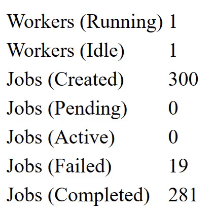

# Composable Queue

[](https://github.com/gnikyt/cq/actions/workflows/cq.yml)
[](https://goreportcard.com/report/github.com/gnikyt/cq)
[](https://godoc.org/github.com/gnikyt/cq)
[](LICENSE)

A lightweight, auto-scaling queue for processing Go functions as jobs. Keep jobs simple, then compose behavior with wrappers for retries, timeouts, tracing, and more.

Inspired by Bull, Pond, Ants, and more.

## Features

- Auto-scaling worker pool (min/max workers)
- Composable job wrappers (retries, timeouts, backoffs, etc.)
- Priority queue with weighted dispatch
- Job scheduler for recurring and one-time jobs
- Pause/resume queue execution (local or distributed)
- Job metadata (ID, enqueue time, attempt count)
- Circuit breaker for fault tolerance
- Optional queue lifecycle hooks (enqueue/start/success/failure/discard/
  reschedule plus retry-attempt events)
- Queue-level middleware chain for all jobs
- Job tagging and batch tracking
- Overlap prevention and uniqueness constraints
- Workflow step checkpointing for retry-safe chains/dependencies
- Tracing hooks for observability
- Zero external dependencies for core functionality

## Feature Matrix

Use this as a quick guide before diving into detailed sections.

| Capability | Primary APIs | What it solves |
| --- | --- | --- |
| Queueing and workers | `NewQueue`, `Submit`, `Stop` | Run background jobs with auto-scaling workers |
| Reliability | `WithRetryPolicy`, `WithRetry`, `WithRetryIf`, `WithBackoff`, `WithRecover` | Handle transient failures and panic recovery |
| Time control | `WithTimeout`, `WithDeadline`, `SubmitAfter` | Bound execution and schedule delayed runs |
| Flow orchestration | `WithChain`, `WithPipeline`, `WithBatch`, `WithDependsOn`, `WithCheckpoint` | Build multi-step and grouped workflows with configurable dependency failure modes |
| Concurrency safety | `WithoutOverlap`, `WithUnique`, `WithConcurrencyByKey` | Prevent overlap, deduplicate work, and limit concurrent execution per key |
| Deferral and release | `WithRelease`, `WithReleaseSelf`, `WithRateLimitRelease` | Re-enqueue instead of blocking workers |
| Rate and fault protection | `WithRateLimit`, `WithCircuitBreaker` | Protect upstream services under load/failure |
| Observability and outcomes | `WithTracing`, `WithOutcome`, `WithHooks`, `MetaFromContext`, `LastErrorFromContext` | Track attempts, prior retry errors, durations, and queue lifecycle transitions |
| Queue-wide wrappers | `WithMiddleware` | Apply cross-cutting behavior to every enqueued job |
| Multi-queue routing | `NewQueueManager`, `QueueManager.Submit`, `QueueManager.SubmitAfter`, `NewPriorityQueueManager`, `Register`, `StartAll`, `StopAll` | Route standard or priority jobs to named queues with isolated worker pools |
| Prioritization and scheduling | `NewPriorityQueue`, `PriorityQueue.Submit`, `PriorityQueue.SubmitAfter`, `NewPriorityQueueManager`, `NewScheduler` | Prioritize urgent jobs, route them by name, and run recurring work with typed submission outcomes |

## When to Use

- **Standalone**: Process jobs in-memory without external infrastructure. Great for CLI tools, internal services, or cases where Redis/SQS is unnecessary.
- **With external queues**: Use cq as the execution engine behind SQS, Redis, RabbitMQ, or any broker that feeds jobs.
- **With external persistence**: Keep durability outside cq with DB outbox polling or queue-native retries/DLQ semantics.
- **Embedded**: Add background processing to an existing app without introducing new operational infrastructure.

## Quick Start

```go
package main

import (
	"context"
	"log"
	"os/signal"
	"syscall"
	"time"

	"github.com/gnikyt/cq"
)

func doWork(ctx context.Context) error {
	meta := cq.MetaFromContext(ctx)
	log.Printf("job %s started, queued %v ago", meta.ID, time.Since(meta.EnqueuedAt))
	time.Sleep(2 * time.Second)
	log.Printf("job %s completed", meta.ID)
	return nil
}

func main() {
	// Listen for interrupt signals.
	ctx, stop := signal.NotifyContext(context.Background(), syscall.SIGINT, syscall.SIGTERM)
	defer stop()

	// Create queue with the signal context.
	queue := cq.NewQueue(1, 10, 100, cq.WithContext(ctx))
	queue.Start()

	// Submit work...
	_, _ = queue.Submit(context.Background(), func(ctx context.Context) error {
		return doWork(ctx)
	})

	// Wait for shutdown signal.
	<-ctx.Done()

	// Stop queue, wait for in-flight jobs to finish.
	queue.Stop(true)
}
```

### Quick Start: Named Queues

```go
highQ := cq.NewQueue(5, 50, 1000) // High-priority lane.
lowQ := cq.NewQueue(1, 5, 5000)   // Bulk/background lane.

mgr := cq.NewQueueManager()
if err := mgr.Register("high", highQ); err != nil {
	log.Fatal(err)
}
if err := mgr.Register("low", lowQ); err != nil {
	log.Fatal(err)
}

mgr.StartAll()
defer mgr.StopAll(true)

if _, err := mgr.Submit(ctx, "high", processCritical); err != nil {
	log.Fatal(err)
}
if _, err := mgr.Submit(ctx, "low", processBulk); err != nil {
	log.Fatal(err)
}

if _, err := mgr.SubmitAfter(ctx, "low", processLater, 30*time.Second); err != nil {
	log.Fatal(err)
}
```

### Quick Start: Named Priority Queues

```go
criticalBase := cq.NewQueue(5, 20, 500)
criticalBase.Start()

bulkBase := cq.NewQueue(2, 10, 1000)
bulkBase.Start()

pmgr := cq.NewPriorityQueueManager()
if err := pmgr.Register("critical", cq.NewPriorityQueue(criticalBase, 100)); err != nil {
	log.Fatal(err)
}
if err := pmgr.Register("bulk", cq.NewPriorityQueue(bulkBase, 200)); err != nil {
	log.Fatal(err)
}

defer pmgr.StopAll(true)

if _, err := pmgr.Submit(ctx, "critical", processNow, cq.PriorityHighest); err != nil {
	log.Fatal(err)
}
if _, err := pmgr.SubmitAfter(ctx, "bulk", processLater, cq.PriorityLow, time.Minute); err != nil {
	log.Fatal(err)
}
```

## Wrapper Composition

Wrappers let you add behavior to jobs without modifying the job itself.
Compose them from **innermost to outermost**: the outermost wrapper runs first
and controls the flow. This keeps job logic clean while adding retries,
timeouts, tracing, and error handling declaratively.

```go
job := WithOutcome(              // 3. Outermost: catches final outcome.
	WithRetryPolicy(            // 2. Preferred retry wrapper.
		WithTimeout(             // 1. Innermost: runs with timeout.
				actualJob,
				5*time.Minute,
			),
		RetryPolicy{
			MaxAttempts: 3,
			Backoff:     ExponentialBackoff,
		},
	),
	onComplete,
	onFail,
	onDiscard,
)
```

**Execution flow:**
1. `WithOutcome` calls `WithRetryPolicy`
2. `WithRetryPolicy` calls `WithTimeout`
3. `WithTimeout` runs `actualJob` with a 5-minute timeout
4. If `actualJob` fails, control returns up the chain for retry logic
5. After all retries, `WithOutcome` receives the final outcome

`WithRetryPolicy` is the recommended default for retry behavior. `WithRetry`,
`WithRetryIf`, and `WithBackoff` still exist for finer-grained manual composition.

## Common Recipes

Use these first when you want practical defaults quickly.

### Reliable API Call (timeout + retry + backoff)

```go
job := cq.WithRetryPolicy(
	cq.WithTimeout(fetchFromAPI, 10*time.Second),
	cq.RetryPolicy{
		MaxAttempts: 3,
		Backoff:     cq.ExponentialBackoff,
	},
)
_, _ = queue.Submit(context.Background(), job)
```

### Retry-safe chain step (checkpoint)

```go
store := cq.NewMemoryCheckpointStore()
step := cq.WithCheckpoint(
	sendInvoice,
	"send-invoice",
	store,
	cq.WithCheckpointNamespace("billing"),
)

job := cq.WithChain(
	validateOrder,
	step, // Will be skipped on retry after first success.
	notifyCustomer,
)
_, _ = queue.Submit(context.Background(), job)
```

Inside a checkpointed job, use `SaveCheckpointData` when progress must be
persisted before the job returns:

```go
if err := cq.SaveCheckpointData(ctx, []byte("batch-42-complete")); err != nil {
	return err
}
```

### Idempotent Work (unique + timeout)

```go
locker := cq.NewUniqueMemoryLocker()
job := cq.WithUnique(
	cq.WithTimeout(processOrder, 30*time.Second),
	"order:123",
	5*time.Minute,
	locker,
)
_, _ = queue.Submit(context.Background(), job)
```

### Long-Running Unique Locks (optional touch renewal)

`WithUniqueWindow` keeps a fixed window by default. `WithUnique` can also be
manually renewed when configured with a positive unique duration.
For manual extension, use `TouchLock` inside your job when the locker implements
optional lease renewal (`RenewableLocker` with `Touch`).
`TouchLock` returns `nil` when lease renewal succeeds,
`ErrUniqueLeaseLost` when renewal fails (for example lock ownership lost), and
`ErrTouchLockUnavailable` when called outside a renewable unique-lock context.

```go
job := cq.WithUnique(func(ctx context.Context) error {
	if err := cq.TouchLock(ctx, 30*time.Second); err != nil {
		return err // Handle cq.ErrUniqueLeaseLost / cq.ErrTouchLockUnavailable as needed.
	}
	return doWork(ctx)
}, "index-products", 30*time.Second, locker)
```

For custom ownership token formats, pass `WithUniqueTokenGenerator(...)`.

### Recurring Job (scheduler)

```go
scheduler := cq.NewScheduler(context.Background(), queue)
defer scheduler.Stop()

schedule, err := scheduler.Every(
	"sync-products",
	10*time.Minute,
	syncProductsJob,
	cq.WithJobName("sync-products"),
)

latest, submitErr, attempted := schedule.Latest()
```

## Queue

### Creating a Queue

```go
queue := cq.NewQueue(1, 100, 1000)
queue.Start()
defer queue.Stop(true)
```

Parameters: `NewQueue(minWorkers, maxWorkers, capacity)`.

### Submission

```go
// Recommended v2 submission API.
handle, err := queue.Submit(ctx, job,
	cq.WithJobID("message-123"),
	cq.WithJobName("process-message"),
	cq.WithJobAttribute("source", "sqs"),
)
if err != nil {
	log.Fatal(err) // Job was not accepted.
}

// Waiting is optional. A wait timeout does not cancel the running job.
if err := handle.Wait(ctx); err != nil {
	log.Printf("job failed or wait ended: %v", err)
}

// Blocks until accepted or ctx ends.
handle, err := queue.Submit(ctx, job)

// Returns ErrQueueFull instead of waiting for capacity.
handle, err = queue.Submit(ctx, job, cq.WithNonBlocking())

scheduled, err := queue.SubmitAfter(ctx, job, 2*time.Minute)
handles, err := queue.SubmitBatch(ctx, jobs)
scheduledHandles, err := queue.SubmitBatchAfter(ctx, jobs, 30*time.Second)

// Resubmit a running job later.
rescheduled, err := cq.Reschedule(ctx, queue, job, time.Minute, cq.RescheduleReasonManualRetry)
```

`Submit` distinguishes submission failure from execution failure. It returns an
error only when the queue does not accept the job. After acceptance, `JobHandle`
tracks completion through `Done`, `Wait`, and `Result`. `Cancel` prevents a
pending job from executing or signals a running job through its context. Running
jobs must respect context cancellation for the request to stop execution. Custom
IDs are visible through `MetaFromContext`, lifecycle hooks, and default checkpoint
keys.

`Cancel` returns whether that call cancelled pending execution or delivered the
first request to a running job. Cancelling an already-buffered job prevents its
body from running, but does not immediately reclaim its internal queue slot.

`SubmitAfter` accepts scheduling responsibility immediately. Its handle remains
pending during the delay, then reports the eventual execution result or a future
rejection such as `ErrQueueStopped`, `ErrQueuePaused`, or `ErrQueueFull`.
Batch methods return handles for accepted jobs and preserve partial-acceptance
errors.

`Reschedule` creates a fresh delayed submission while preserving the current
job name and attributes. It adds parent ID, root ID, and reason lineage
attributes and returns the new submission handle.

Typed submission rejection errors:
- `cq.ErrQueueStopped`
- `cq.ErrQueuePaused`
- `cq.ErrQueueFull`
- `cq.ErrQueueJobRequired`

### Metrics

```go
queue.RunningWorkers()           // Current running workers.
queue.IdleWorkers()              // Current idle workers.
queue.Capacity()                 // Job channel capacity.
queue.WorkerRange()              // (min, max) workers.
queue.Stats()                    // Single-call queue snapshot.
queue.SetWorkerRange(2, 20)      // Update (min, max) at runtime.
queue.TallyOf(cq.JobStateFailed) // Count by state.

// Available job states for TallyOf:
// cq.JobStateCreated   - Total jobs accepted.
// cq.JobStatePending   - Jobs waiting in the queue.
// cq.JobStateActive    - Jobs currently executing.
// cq.JobStateFailed    - Jobs completed with error.
// cq.JobStateCancelled - Jobs completed through handle cancellation.
// cq.JobStateCompleted - Jobs completed successfully.
// cq.JobStateDiscarded - Jobs marked as discarded outcomes.
```

`queue.Stats()` returns `cq.QueueStats` with queue name (`Name`), queue state
(`Stopped`, `Paused`), worker details (`WorkersMin`, `WorkersMax`,
`RunningWorkers`, `IdleWorkers`, `Capacity`), and job tallies
(`CreatedJobs`, `PendingJobs`, `ActiveJobs`, `FailedJobs`, `DiscardedJobs`,
`CancelledJobs`, `CompletedJobs`, `RescheduledJobs`, `ReleasedJobs`) in one
snapshot call.

### Runtime Scaling

```go
if err := queue.SetWorkerRange(2, 20); err != nil {
	log.Fatal(err)
}
```

`SetWorkerRange` starts workers immediately when `min` increases.
When `max` decreases, running workers are not touched; idle cleanup drains
excess workers.

### Options

```go
queue := cq.NewQueue(1, 10, 100,
	cq.WithWorkerIdleTick(500*time.Millisecond),
	cq.WithContext(ctx),
	cq.WithPanicHandler(func(err any) {
		log.Printf("panic: %v", err)
	}),
)

// Available options:
// cq.WithWorkerIdleTick(d)           - Interval for idle worker cleanup (default 5s).
// cq.WithContext(ctx)                - Parent context for the queue.
// cq.WithCancelableContext(ctx, fn)  - Parent context with custom cancel function.
// cq.WithPanicHandler(fn)            - Custom handler override for job panics.
// cq.WithIDGenerator(fn)             - Override fallback job ID generation.
// cq.WithQueueName(name)             - Stable queue name for observability events/stats.
// cq.WithPauseStore(store, key)      - Share pause state across queue instances.
// cq.WithPausePollTick(d)            - Poll interval for distributed pause sync.
// cq.WithPauseBehavior(mode)         - Buffer or reject enqueue while paused.
// cq.WithMiddleware(mw...)           - Apply queue-level wrappers to all jobs.
// cq.WithHooks(hooks)                - Register queue lifecycle hooks.
```

### Queue Middleware

```go
withLogging := func(next cq.Job) cq.Job {
	return func(ctx context.Context) error {
		log.Println("job start")
		err := next(ctx)
		log.Printf("job end: %v", err)
		return err
	}
}

queue := cq.NewQueue(1, 10, 100, cq.WithMiddleware(withLogging))
```

`WithMiddleware(a, b)` composes as `a(b(job))`: `a` wraps `b` (outermost) and
`b` wraps `job` (innermost).
This lets you apply common middleware to all jobs sent to that queue instead
of wiring middleware per job.

### Pause / Resume

```go
if err := queue.Pause(); err != nil {
	log.Fatal(err)
}

// ... perform maintenance ...

if err := queue.Resume(); err != nil {
	log.Fatal(err)
}
```

Use `cq.WithPauseBehavior(cq.PauseReject)` if you prefer rejecting enqueue while paused.

### Stopping

```go
queue.Stop(true)   // Wait for jobs to finish.
queue.Stop(false)  // Don't wait for queued jobs.
queue.StopContext(ctx) // Wait for jobs or stop when ctx is done.
queue.StopTimeout(5 * time.Second) // Wait up to timeout duration.
queue.Terminate()  // Immediate shutdown.
```

## Documentation

For detailed usage and advanced features, see the following guides:

- **[Job Wrappers](docs/JOB_WRAPPERS.md)** - Complete reference for all job wrappers including retries, timeouts, tracing, rate limiting, circuit breakers, and custom wrappers
- **[Queue Options](docs/QUEUE_OPTIONS.md)** - Queue configuration options including context, panic handling, hooks, and custom ID generation
- **[Priority Queue](docs/PRIORITY_QUEUE.md)** - Weighted fair queuing with custom priority levels and dispatch strategies
- **[Queue Routing](docs/QUEUE_ROUTING.md)** - Register named queues and route jobs to isolated worker pools
- **[Scheduler](docs/SCHEDULER.md)** - Recurring and one-time job scheduling with cron-like behavior
- **[Custom Locker](docs/CUSTOM_LOCKER.md)** - Capability interfaces and a Redis example for distributed `WithUnique` and `WithoutOverlap` locks
- **[Custom Checkpoint Store](docs/CUSTOM_CHECKPOINT_STORE.md)** - Distributed checkpoint implementations for `WithCheckpoint` with Redis and SQLite examples
- **[Custom Key Concurrency Limiter](docs/CUSTOM_CONCURRENCY_LIMITER.md)** - Distributed limiter implementations for `WithConcurrencyByKey` with Redis and SQLite examples

## Testing

Run the full suite:

```
go test ./...
ok  	github.com/gnikyt/cq	17.117s
```

Run with race detector:

```
go test -race ./...
ok  	github.com/gnikyt/cq	18.548s
```

### Benchmarks

Run benchmarks:

```
go test -run=^$ -bench=. -benchmem ./...
goos: darwin
goarch: arm64
cpu: Apple M5
BenchmarkScenarios/100Req--10kJobs-10                      1    1595968709 ns/op
	987336904 B/op	12180834 allocs/op
BenchmarkScenarios/1kReq--1kJobs-10                        1    1233305000 ns/op
	954452224 B/op	12012438 allocs/op
BenchmarkScenarios/10kReq--100Jobs-10                      1    1902146167 ns/op
	960816464 B/op	12094121 allocs/op
BenchmarkScenariosSteadyState/100Req--10kJobs-10           1    1199676209 ns/op
	953164216 B/op	12002842 allocs/op
BenchmarkScenariosSteadyState/1kReq--1kJobs-10             1    1206286625 ns/op
	955462864 B/op	12018107 allocs/op
BenchmarkScenariosSteadyState/10kReq--100Jobs-10           1    2188002542 ns/op
	1047668752 B/op	12574643 allocs/op
BenchmarkSingle-10                                     73831      16707 ns/op
	84418 B/op	      30 allocs/op
BenchmarkSingleSteadyState-10                        1000000       1369 ns/op
	983 B/op	      13 allocs/op
```

## Demo

*Note:* The demo is old and intentionally basic.

```bash
go run example/web_direct.go
```

```bash
for i in {1..500}; do
  curl -s -X POST localhost:8080/order -d '{"demo":"yes"}' -H "Content-Type: application/json"
done
```


