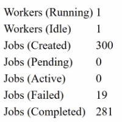

# Composable Queue

[](https://github.com/gnikyt/cq/actions/workflows/cq.yml)
[](https://goreportcard.com/report/github.com/gnikyt/cq)
[](https://godoc.org/github.com/gnikyt/cq)
[](LICENSE)

An auto-scaling queue that processes functions as jobs. Jobs can be simple functions or composed with job wrappers.

Inspired by Bull, Pond, Ants, and more.

## Features

- Auto-scaling worker pool (min/max workers)
- Composable job wrappers (retries, timeouts, backoffs, etc.)
- Priority queue with weighted dispatch
- Job scheduler for recurring and one-time jobs
- Job metadata (ID, enqueue time, attempt count)
- Circuit breaker for fault tolerance
- Job tagging and batch tracking
- Overlap prevention and uniqueness constraints
- Tracing hooks for observability
- Zero external dependencies for core functionality

## When to Use

**Standalone**: Process jobs in-memory without external infrastructure. Ideal for CLI tools, small services, or when Redis/SQS overhead isn't justified.

**With external queues**: Combine with SQS, Redis, RabbitMQ, or other message brokers. Use cq as the worker pool that processes messages from your broker.

**Embedded**: Add background processing to existing applications without introducing new infrastructure dependencies.

## Table of Contents

* [Quick Start](#quick-start)
* [Wrapper Composition](#wrapper-composition)
* [Testing](#testing)
* [Examples](#examples)
  - [Queue](#queue)
  - [Jobs](#jobs)
  - [Priority Queue](#priority-queue)
  - [Scheduler](#scheduler)
* [Demo](#demo)

## Quick Start

```go
package main

import (
	"context"
	"fmt"

	"github.com/gnikyt/cq"
)

func main() {
	queue := cq.NewQueue(1, 10, 100)
	queue.Start()
	defer queue.Stop(true)

	queue.Enqueue(func(ctx context.Context) error {
		fmt.Println("processing job")
		return nil
	})
}
```

## Wrapper Composition

Wrappers are composed from **innermost to outermost**. The outermost wrapper runs first and controls the flow.

```go
job := WithResultHandler(        // 4. Outermost: catches final result.
	WithRetry(                   // 3. Retries on error.
		WithBackoff(             // 2. Adds delay between retries.
			WithTimeout(         // 1. Innermost: runs with timeout.
				actualJob,
				5*time.Minute,
			),
			ExponentialBackoff,
		),
		3,
	),
	onComplete,
	onFail,
)
```

**Execution flow:**
1. `WithResultHandler` calls `WithRetry`
2. `WithRetry` calls `WithBackoff`
3. `WithBackoff` waits (if retry > 0), then calls `WithTimeout`
4. `WithTimeout` runs `actualJob` with a 5-minute timeout
5. If `actualJob` fails, control returns up the chain for retry logic
6. After all retries, `WithResultHandler` receives the final result

## Testing

`make test`

```
ok      github.com/gnikyt/cq    17.586s coverage: 91.2% of statements
```

### Benchmarks

`make bench`

```
cpu: Apple M5
BenchmarkScenarios/100Req--10kJobs-10                             7    192443179 ns/op
BenchmarkScenarios/1kReq--1kJobs-10                               7    194722393 ns/op
BenchmarkScenarios/10kReq--100Jobs-10                             7    352322048 ns/op
BenchmarkSingleSteadyState-10                               3063700        393.4 ns/op
```

## Examples

### Queue

#### Creating a Queue

```go
queue := cq.NewQueue(1, 100, 1000)
queue.Start()
defer queue.Stop(true)
```

Parameters: `NewQueue(minWorkers, maxWorkers, capacity)`

#### Enqueue Methods

```go
queue.Enqueue(job)                            // Blocking.
queue.TryEnqueue(job)                         // Non-blocking, returns bool.
queue.DelayEnqueue(job, 2*time.Minute)        // Delayed.
queue.EnqueueBatch(jobs)                      // Multiple jobs.
queue.DelayEnqueueBatch(jobs, 30*time.Second) // Delayed, multiple jobs.
```

#### Metrics

```go
queue.RunningWorkers()           // Current running workers.
queue.IdleWorkers()              // Current idle workers.
queue.Capacity()                 // Job channel capacity.
queue.WorkerRange()              // (min, max) workers.
queue.TallyOf(cq.JobStateFailed) // Count by state.
```

#### Options

```go
queue := cq.NewQueue(1, 10, 100,
	cq.WithWorkerIdleTick(500*time.Millisecond),
	cq.WithContext(ctx),
	cq.WithPanicHandler(func(err any) {
		log.Printf("panic: %v", err)
	}),
)
```

#### Stopping

```go
queue.Stop(true)   // Wait for jobs to finish.
queue.Stop(false)  // Don't wait for queued jobs.
queue.Terminate()  // Immediate shutdown.
```

### Jobs

Jobs are functions with signature `func(ctx context.Context) error`.

#### Basic Function

```go
job := func(ctx context.Context) error {
	return doWork()
}
queue.Enqueue(job)
```

#### Job Metadata

Every job receives metadata through its context, including a unique ID, enqueue timestamp, and current retry attempt. Access this information for logging, debugging, or conditional logic.

```go
job := func(ctx context.Context) error {
	meta := cq.MetaFromContext(ctx)
	log.Printf(
		"job %s, attempt %d, queued %v ago",
		meta.ID, meta.Attempt, time.Since(meta.EnqueuedAt),
	)
	return doWork()
}
queue.Enqueue(job)
```

The `JobMeta` struct contains:
- `ID` - Unique identifier for the job
- `EnqueuedAt` - Timestamp when the job was enqueued
- `Attempt` - Current retry attempt (0-indexed, incremented by `WithRetry`)

#### Retries

Automatically retry a job a specified number of times on failure. Useful for transient errors like network timeouts or temporary service unavailability.

```go
job := cq.WithRetry(func(ctx context.Context) error {
	return fetchEndpoint()
}, 3)
queue.Enqueue(job)
```

Conditional retries allow you to retry only on specific errors:

```go
job := cq.WithRetryIf(actualJob, 5, func(err error) bool {
	return cq.IsClass(err, cq.ErrorClassRetryable)
})
```

#### Backoff

Add delays between retry attempts to avoid overwhelming external services. Combine with `WithRetry` for exponential backoff, fibonacci sequences, or jittered delays.

```go
job := cq.WithRetry(
	cq.WithBackoff(actualJob, cq.ExponentialBackoff),
	3,
)
queue.Enqueue(job)
```

Built-in backoff functions: `ExponentialBackoff`, `FibonacciBackoff`, `JitterBackoff`

#### Result Handler

Execute callbacks on job completion or failure. Useful for logging, metrics, notifications, or triggering follow-up actions. Another useful case is sending to a DLQ on error.

```go
job := cq.WithResultHandler(
	actualJob,
	func() { log.Println("success") },
	func(err error) { log.Printf("failed: %v", err) },
)
queue.Enqueue(job)
```

#### Error Classifier

Categorize errors as retryable, permanent, or ignored. Works with `WithRetryIf` to implement smart retry logic based on error types.

```go
classifier := func(err error) cq.ErrorClass {
	if isRateLimit(err) {
		return cq.ErrorClassRetryable
	}
	return cq.ErrorClassPermanent
}

job := cq.WithRetryIf(
	cq.WithErrorClassifier(actualJob, classifier), // Job wrapped with classifier.
	5,                                             // Max retry attempts.
	func(err error) bool {
		return cq.IsClass(err, cq.ErrorClassRetryable)
	}, // Predicate: retry only retryable errors.
)
queue.Enqueue(job)
```

#### Tracing

Hook into job lifecycle for observability. Integrate with OpenTelemetry, Datadog, or custom metrics systems to track job execution times and failures.

```go
type myHook struct{}

func (h myHook) Start(ctx context.Context, name string) context.Context {
	return ctx
}

func (h myHook) Success(ctx context.Context, d time.Duration) {
	log.Printf("success: %s", d)
}

func (h myHook) Failure(ctx context.Context, err error, d time.Duration) {
	log.Printf("failure: %v (%s)", err, d)
}

job := cq.WithTracing(actualJob, "sync-products", myHook{})
queue.Enqueue(job)
```

#### Skip If

Conditionally skip job execution based on runtime state. Useful for feature flags, maintenance windows, or when preconditions aren't met.

```go
job := cq.WithSkipIf(actualJob, func(ctx context.Context) bool {
	return !shouldProcess()
})
queue.Enqueue(job)
```

#### Timeout

Cancel a job if it exceeds a duration. Prevents runaway jobs from blocking workers indefinitely.

```go
job := cq.WithTimeout(actualJob, 5*time.Minute)
queue.Enqueue(job)
```

#### Deadline

Cancel a job if it runs past a specific point in time. Useful for time-sensitive operations that become irrelevant after a certain moment.

```go
deadline := time.Date(2025, 12, 25, 16, 0, 0, 0, time.Local)
job := cq.WithDeadline(actualJob, deadline)
queue.Enqueue(job)
```

#### Overlap Prevention

Prevent concurrent execution of jobs with the same key. Ensures only one instance of a job runs at a time, useful for operations that shouldn't overlap like account syncs.

```go
locker := cq.NewOverlapMemoryLocker()
job := cq.WithoutOverlap(actualJob, "account-123", locker)
queue.Enqueue(job)
```

#### Unique Jobs

Deduplicate jobs within a time window. Prevents the same job from being enqueued multiple times, useful for debouncing or ensuring idempotency.

```go
locker := cq.NewUniqueMemoryLocker()
job := cq.WithUnique(actualJob, "index-products", 1*time.Hour, locker)
queue.Enqueue(job)
```

#### Chains

Execute multiple jobs sequentially, stopping on the first error. Useful for multi-step workflows where each step depends on the previous one succeeding.

```go
job := cq.WithChain(step1, step2, step3)
queue.Enqueue(job)
```

#### Pipeline

Chain jobs that pass data between steps via channels. Useful for data processing workflows where each stage transforms or enriches the data.

```go
step1 := func(ch chan<- int) cq.Job {
	return func(ctx context.Context) error {
		ch <- 42
		return nil
	}
}

step2 := func(ch <-chan int) cq.Job {
	return func(ctx context.Context) error {
		value := <-ch
		return process(value)
	}
}

job := cq.WithPipeline(step1, step2)
queue.Enqueue(job)
```

#### Batch

Track a group of jobs as a single unit with progress reporting and completion callbacks. Useful for bulk operations where you need to know when all jobs finish.

```go
jobs := []cq.Job{job1, job2, job3}
batchJobs, state := cq.WithBatch(
	jobs,
	func(errs []error) { log.Printf("done: %d errors", len(errs)) },
	func(done, total int) { log.Printf("%d/%d", done, total) },
)
queue.EnqueueBatch(batchJobs)
```

#### Release

Re-enqueue a job after a delay when specific errors occur. Useful for handling rate limits or temporary resource unavailability without blocking the worker.

```go
job := cq.WithRelease(
	actualJob,
	queue,             // Queue to re-enqueue into.
	30*time.Second,    // Delay before re-enqueue.
	3,                 // Max releases before giving up.
	func(err error) bool {
		return errors.Is(err, ErrRateLimited)
	}, // Predicate: which errors trigger release.
)
queue.Enqueue(job)
```

#### Recover

Convert panics into errors instead of crashing the worker. Ensures a misbehaving job doesn't bring down the entire queue.

```go
job := cq.WithRecover(func(ctx context.Context) error {
	panic("oops")
})
queue.Enqueue(job)
```

#### Tagged

Associate jobs with tags for tracking and bulk cancellation. Useful for cancelling all jobs for a specific user, tenant, or operation type.

```go
registry := cq.NewJobRegistry()
job := cq.WithTagged(actualJob, registry, "user:123", "export")
queue.Enqueue(job)

registry.CancelForTag("user:123")
```

#### Rate Limit

Limit job execution rate using a token bucket algorithm. Jobs wait for a token before executing... if the limit is exceeded, they block until a token becomes available or the context is cancelled. Useful for respecting external API rate limits or preventing resource exhaustion.

```go
limiter := rate.NewLimiter(10, 5) // 10 per second, burst of 5.
job := cq.WithRateLimit(actualJob, limiter)
queue.Enqueue(job)
```

#### Circuit Breaker

Stop calling a failing service after repeated failures. The circuit "opens" after a threshold of consecutive failures, rejecting jobs immediately for a cooldown period. After cooldown, the circuit "closes" and allows jobs through again. Useful for protecting against cascading failures when a dependency is down.

```go
// Shared circuit breaker across all jobs calling a payment API.
paymentCB := cq.NewCircuitBreaker(5, 30*time.Second)

for _, orderID := range orderIDs {
	job := cq.WithCircuitBreaker(func(ctx context.Context) error {
		return processPayment(orderID)
	}, paymentCB)
	queue.Enqueue(job)
}

// If 5 consecutive jobs fail, the circuit opens.
// Remaining jobs return cq.ErrCircuitOpen immediately without attempting.
// After 30s cooldown, circuit closes and allows one job through to test recovery.
// If that job succeeds, circuit stays closed and failure count resets.
// If it fails, circuit opens again for another 30s cooldown.
```

#### Custom Wrapper

Create your own wrappers by following the decorator pattern. Any function that takes a `Job` and returns a `Job` can be composed with the built-in wrappers.

```go
func withLogging(job cq.Job) cq.Job {
	return func(ctx context.Context) error {
		log.Println("starting")
		err := job(ctx)
		log.Printf("finished: %v", err)
		return err
	}
}

job := withLogging(actualJob)
queue.Enqueue(job)
```

### Priority Queue

Dispatch jobs based on priority levels using weighted fair queuing. Higher priority jobs get more execution slots per tick, but lower priorities still make progress. Useful when some jobs are more time-sensitive than others.

```go
queue := cq.NewQueue(2, 10, 100)
queue.Start()

pq := cq.NewPriorityQueue(queue, 50)
defer pq.Stop(true)

pq.Enqueue(criticalJob, cq.PriorityHighest)
pq.Enqueue(normalJob, cq.PriorityMedium)
pq.Enqueue(cleanupJob, cq.PriorityLowest)
```

Priority levels: `PriorityHighest`, `PriorityHigh`, `PriorityMedium`, `PriorityLow`, `PriorityLowest`

Default weights (attempts per tick): `5:3:2:1:1`.

#### Custom Weights

Configure how many jobs from each priority level are dispatched per tick:

```go
pq := cq.NewPriorityQueue(queue, 50,
	cq.WithWeighting(
		cq.NumberWeight(10),
		cq.NumberWeight(5),
		cq.NumberWeight(3),
		cq.NumberWeight(2),
		cq.NumberWeight(1),
	),
)
```

#### Drain Before Stop

Move all buffered jobs to the underlying queue before stopping. Ensures no jobs are dropped during shutdown:

```go
drained := pq.Drain()
pq.Stop(true)
```

### Scheduler

Schedule jobs to run at intervals or specific times. Useful for recurring tasks like cleanup, syncs, or reports, and one-time delayed operations.

```go
queue := cq.NewQueue(2, 10, 100)
queue.Start()

scheduler := cq.NewScheduler(context.Background(), queue)
defer scheduler.Stop()

scheduler.Every("cleanup", 10*time.Minute, cleanupJob)
scheduler.At("reminder", time.Now().Add(1*time.Hour), reminderJob)

scheduler.Has("cleanup")
scheduler.Remove("cleanup")
scheduler.List()
scheduler.Count()
```

#### Cron-like Scheduling

For cron expressions, use an external parser with `Scheduler.At()`:

```go
func ScheduleCron(s *cq.Scheduler, id, expr string, job cq.Job) error {
	gron := gronx.New()
	if !gron.IsValid(expr) {
		return fmt.Errorf("SchedulerCron: invalid cron: %s", expr)
	}

	nextRun, _ := gronx.NextTick(expr, true)

	var scheduled cq.Job
	scheduled = func(ctx context.Context) error {
		err := job(ctx)
		if next, e := gronx.NextTick(expr, false); e == nil {
			s.At(id, next, scheduled)
		}
		return err
	}

	return s.At(id, nextRun, scheduled)
}

ScheduleCron(scheduler, "daily", "0 2 * * *", dailyJob)
```

## Demo

```bash
go run example/web_direct.go
```

```bash
for i in {1..500}; do
  curl -s -X POST localhost:8080/order -d '{"demo":"yes"}' -H "Content-Type: application/json"
done
```


